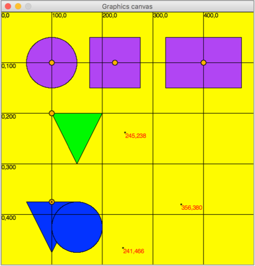

# cs1graphicshelper.py

This script includes 3 helper functions which will make drawing on the Canvas easier.



+ `drawReferencePoints(canvas)`: Marks the reference point of any objects on the canvas with a small orange circle.
+ `drawGrid(canvas,width)`: Draws a labeled grid on the canvas to help pick your coordinate points. Give a width, such as `100` to set the width/height of the grid.
+ `markClicks(canvas)`: Prints the coordinates of every mouse click.

## Demo

Run `demo.py`

## Instructions

[Download this zip](https://github.com/susanBuck/cs1graphics-helper/archive/master.zip), unzip it, and move the file `cs1graphics-helper.py` into your working folder.

Then, on the top of your script, make sure you're importing this script in addition to cs1graphics:

```py
from cs1graphics import *
from cs1graphicsHelper import *
```

Finally, at tne __end__ of your script, invoke 1 or more of the helper functons on your canvas:

```py
drawReferencePoints(paper)
drawGrid(paper,100)
markClicks(paper)
```

__Basic example:__

```py
from cs1graphics import *
from cs1graphicsHelper import *

paper = Canvas(500,500,'yellow')

# Draws a green polygon (cone)
# Note the reference point is the first point in the polygon
def example0():
    poly = Polygon(Point(-50,0), Point(50,0), Point(0,200))
    poly.setFillColor('green')
    poly.moveTo(100,100)
    paper.add(poly)

example0()

# Invoke the helper functions
drawReferencePoints(paper)
drawGrid(paper,100)
markClicks(paper)
```


